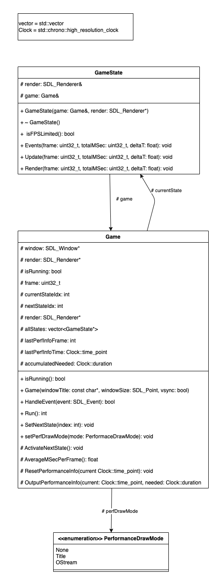

# sdl_basegame

A skeleton project to start your SDL2 journey

# Classes

- Game: The base class for your own game
    - Runs from start to the end of execution and calls Events(), Update(), and Render() on the current GameState
    - Has a prioritzied HandleEvent method that is processed before the GameState events
    - Has two ways of showing msec/frame (which is the same as 1000/FPS, so a higher number means its running slower)
- GameState: The base class for your different game states
    - Can dynamically load and unload it's assets etc. on activation/deactivation with Init() and UnInit()

Either Game and GameState can initiate a state switch by calling SetNextState( number ) or game.SetNextState( number ), the change will happen after the frame has finished processing.

# Classdiagram

Classdiagram outlining base classes and their relations

